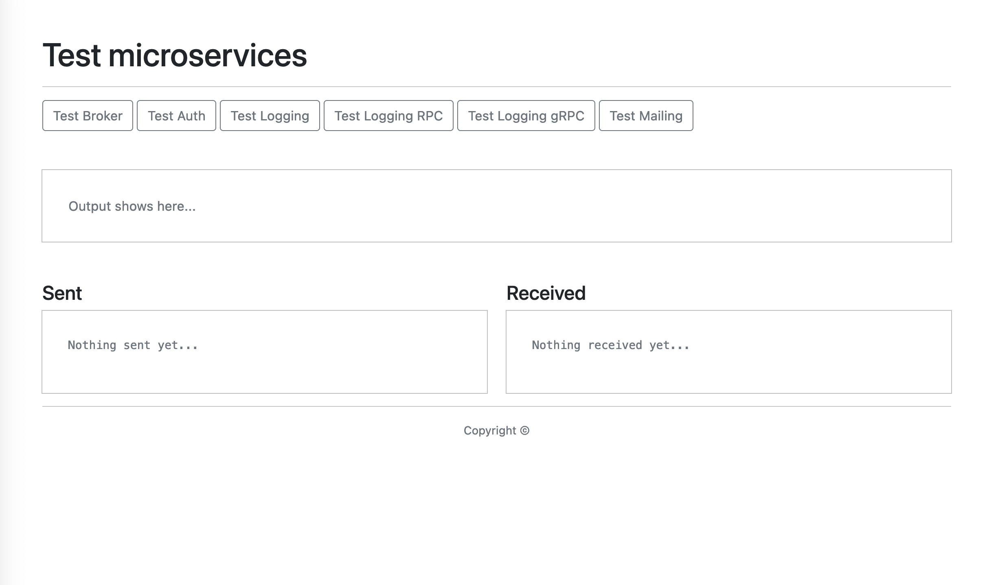
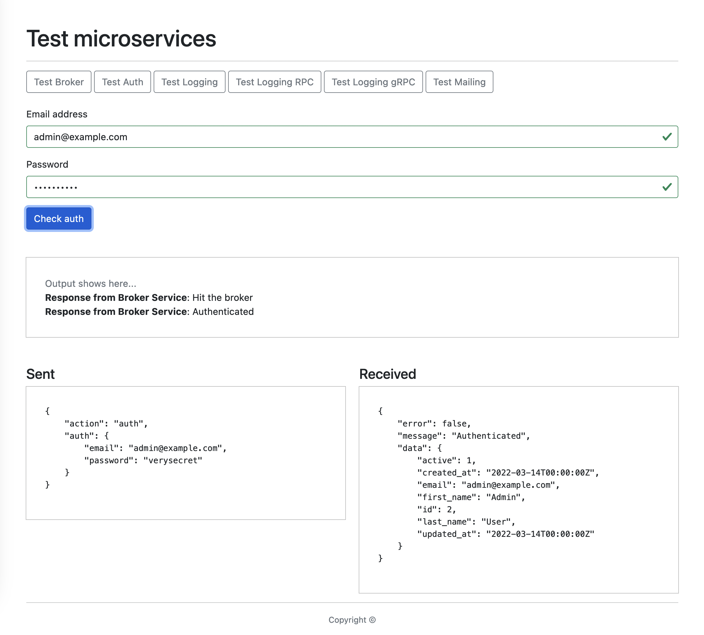
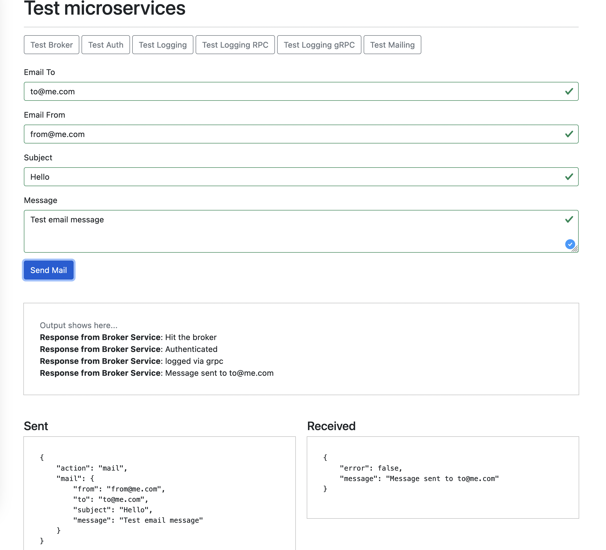

# Go-Microservices

 A front-end web application that connects and works with 5 microservices:

- Broker - optional single point of entry to microservices;
- Authentication - Postgres;
- Logger - Mongo DB;
- Mail - sends emails with a specific template;
- Listener - consumes messages in Rabbit MQ and initiates a process;

Communications between microservices via REST API as JSON as transport, sending and receiving using RPC and gRPC, process events using AMQP.

## How to start

Download and fill .env files like examples and start via make command 

`cd project && make up_build`

Or via docker-compose

`cd project && docker-compose up --build`

Example running in docker swarm: https://swarm.golang.rest/

It uses caddy as proxy server.

